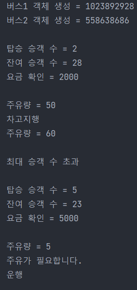

# Spring S.A 과제


### Bus 클래스 어떻게 만들 것인가?
- 내가 생각한 방법은 아래와 같다.
1. Bus 클래스 안에 속성 선언.
2. interface를 이용해 기능 부분을 추상 메서드로 활용.

```agsl
class Main {
    public static void main(String[] args) {

        Bus bus1 = new Bus();
        Bus bus2 = new Bus();
        System.out.println("버스1 객체 생성 = " + bus1.busNumber);
        System.out.println("버스2 객체 생성 = " + bus2.busNumber + "\n");

        bus1.passengerGetOn(2);
        System.out.println();

        bus1.changeGas(-50);
        bus1.changeStatus("차고지행");
        bus1.changeGas(10);
        System.out.println();

        bus1.passengerGetOn(45);
        System.out.println();

        bus1.passengerGetOn(5);
        System.out.println();

        bus1.changeGas(-55);
        bus1.changeStatus("운행");

    }//main
}// class Main
```

> 먼저 메인 클래스는 구현한 코드가 잘 나오는지 확인하기 위함이었고 코드는 일단 정상적으로 나왔다.
> 맨 처음 고민했던 것은 버스의 번호가 고유값이며 객체가 하나가 아니라는 부분이었고 다른 변수를 선언해 1,2로 나눠볼까 생각하다가 해시코드를 사용했다.

<br>

***
<br>

```agsl
public class Bus implements BusInterface{

    final int MAX_PASSENGER_COUNT;  // 최대 승객 수
    final int FARE;  // 요금
    final int busNumber;  // 버스 번호
    int currentPassengerCount;  // 현재 승객 수
    int fuel;  // 주유량
    int currentSpeed;  // 현재 속도
    String status;  // 상태

    public Bus() {

        this.MAX_PASSENGER_COUNT = 30;
        this.currentPassengerCount = currentPassengerCount;
        this.FARE = 1000;
        this.busNumber = hashCode();
        this.fuel = 100;
        this.currentSpeed = currentSpeed;
        this.status = "운행";
    }

    @Override
    public void changeStatus(String status) {
        System.out.println(status);
    }
    @Override
    public void changeGas(int gas) {
        fuel += gas;
        System.out.println("주유량 = " + fuel);
        if (fuel < 10) {
            System.out.println("주유가 필요합니다.");
        }
    }

    @Override
    public void passengerGetOn(int count) {
        if ((MAX_PASSENGER_COUNT-currentPassengerCount) >= count && count > 0) {
            currentPassengerCount += count;
            System.out.println("탑승 승객 수 = " + count);
            System.out.println("잔여 승객 수 = " + (MAX_PASSENGER_COUNT - currentPassengerCount));
            System.out.println("요금 확인 = " + (FARE*count));
        } else {
            System.out.println("최대 승객 수 초과");
        }
    }

}// class Bus
```
> 속성이 들어있는 Bus 클래스로 interface의 추상메서드를 상속받아 사용했다.

<br>

***

<br>

```agsl
public interface BusInterface {
    // 1. 운행
    // 2. 버스 상태 변경
    // 3. 승객 탑승
    // 4. 속도 변경
    void changeStatus(String status);  // 버스 상태 변경 메소드
    void changeGas(int gas);
    void passengerGetOn(int count);  // 승객 탑승 메소드
//    void changeSpeed(int speed);  // 속도 변경 메소드
}
```
> 마지막으로 추상메서드의 집합인 interface에서 각 기능들을 만들어 주었다.

<br>

***

생각보다 클래스 설계는 어려웠다. 변수는 어디에 만들고 기능은 어떤 기능을 만들어야 하는지 등, 생각할게 많았다.<br>

지금 내가 만든 코드가 정확하다고 할 수 없고 한참 부족하지만 하나하나 생각하며 직접 만들어본 경험을 중요하게 생각한다.<br>
앞으로 이런 코드를 자주 만들어보며 무엇을 바꿔야 하는지 찾아가는 연습을 자주하며 어떤 형태로 흘러가는지 파악해야겠다.


